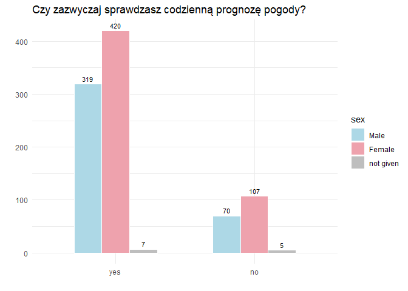
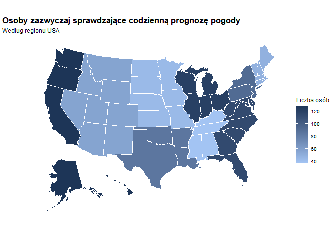
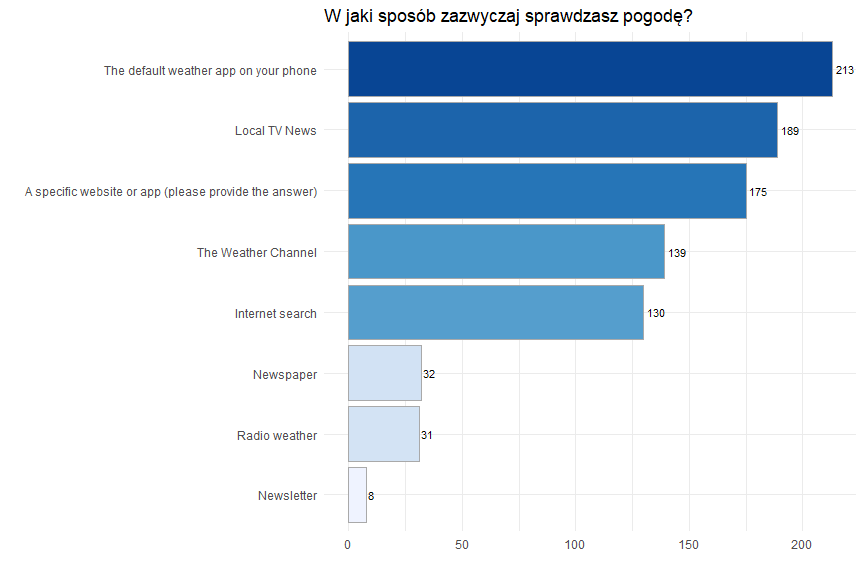
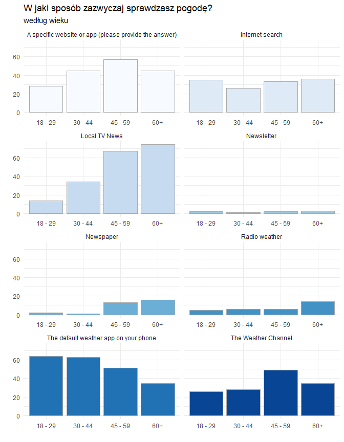
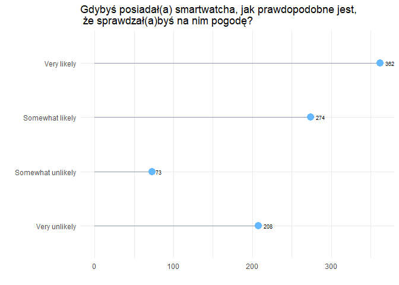
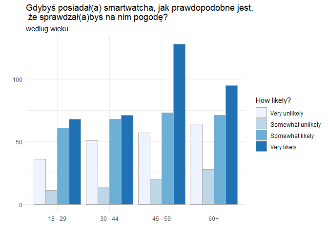
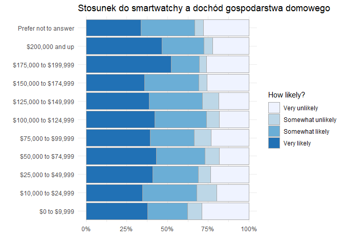

weathercheck-analyst
================
Patrycja Kornobis
2026-08-14

# Wstęp

W projekt analizuje zbiór danych *weather_check* z pakietu
**fivethirtyeight** (dostępny również na
[GitHubie](https://github.com/fivethirtyeight/data/tree/master/weather-check)).

Badanie sprawdza, jak grupy demograficzne (wiek, płeć, dochód, region)
różnią się w zachowaniach związanych z pogodą — m.in. w częstotliwości
sprawdzania prognoz, wyborze źródeł informacji czy korzystaniu ze
smartwatchy.

## Przegląd zmiennych

Zbiór danych zawiera 928 obserwacji (respondentów) oraz 10 zmiennych:

| Nazwa zmiennej | Opis |
|----|----|
| `respondent_id` | Identyfikator respondenta |
| `ck_weather` | Czy zazwyczaj sprawdzasz codzienną prognozę pogody? (Zmienna logiczna przekształcona w faktor: “yes”/“no”) |
| `weather_source` | W jaki sposób zazwyczaj sprawdzasz pogodę? |
| `weather_source_site` | Konkretna strona internetowa lub aplikacja wpisana przez osoby, które wybrały odpowiedź “A specific website or app” |
| `ck_weather_watch` | Gdybyś posiadał(a) smartwatcha, jak prawdopodobne jest, że sprawdzał(a)byś na nim pogodę? |
| `age` | Wiek |
| `female` | Płeć (wartość logiczna TRUE/FALSE) |
| `hhold_income` | Łączny dochód gospodarstwa domowego z ubiegłego roku |
| `region` | Region USA |
| `sex` | Dodatkowa zmienna utworzona na podstawie zmiennej *female* (“Male”, “Female”, “not given”) |

# Analiza

W tej części przejdziemy do szczegółowej analizy zachowań respondentów.
Zbadamy m.in., jak często sprawdzają oni prognozę pogody, jakich źródeł
informacji używają oraz jakie mają podejście do nowych technologii
(smartwatchy).

Szczególną uwagę poświęcimy różnicom demograficznym — sprawdzimy, czy
płeć, wiek lub miejsce zamieszkania mają istotny wpływ na nawyki
związane ze sprawdzaniem pogody.

## Kto zazwyczaj sprawdza codzienną prognoze pogody?

### Zróżnicowanie wegług płci

Analiza zróżnicowania ze względu na płeć pozwala sprawdzić, czy kobiety
i mężczyźni wykazują odmienne nawyki w zakresie monitorowania warunków
atmosferycznych.

#### Komentarz do wykresu

> Zdecydowana większość respondentów obu płci deklaruje regularne
> sprawdzanie codziennej prognozy pogody. W grupie osób odpowiadających
> twierdząco przeważają kobiety (**420** wskazań) nad mężczyznami
> (**319**). Brak zainteresowania prognozą pogody jest zjawiskiem
> rzadkim w badanej próbie – odpowiedź odmowną zaznaczyło jedynie
> **107** kobiet i **70** mężczyzn. Wskazania bez podanej płci stanowią
> margines badania (łącznie **12** osób).

### Zróżnicowanie regionalne

Analiza w układzie terytorialnym pozwala zweryfikować, czy miejsce
zamieszkania respondentów wpływa na ich zainteresowanie codzienna
prognozą pogody. Różnice regionalne mogą wynikać m.in. ze specyfiki
lokalnego klimatu, uwarunkowań geograficznych czy stopnia zurbanizowania
poszczególnych obszarów.

#### Komentarz do wykresu

> Analiza przestrzenna potwierdza znaczne zróżnicowanie w liczbie osób
> regularnie śledzących prognozy pogody w zależności od regionu USA.
> Najciemniejszymi odcieniami granatu odznaczają się regiony **Pacific**
> (Wybrzeże Zachodnie wraz z Alaską i Hawajami), **East North Central**
> (rejon Wielkich Jezior) oraz **South Atlantic** (południowo-wschodnie
> wybrzeże) — tam liczba wskazań przekracza 110 osób.

> Najjaśniejsze barwy przypisane są do regionów **East South Central**
> oraz **West North Central**, co wskazuje na najniższą liczbę
> respondentów deklarujących codzienne sprawdzanie pogody w tych
> obszarach. Wyraźna zmienność geograficzna może wynikać zarówno z
> lokalnej specyfiki klimatycznej (wysoka dynamika zjawisk pogodowych na
> wybrzeżach i na północy), jak i z reprezentatywności próby w
> poszczególnych stanach.

### Zróżnicowanie względem wieku

Analiza wieku pozwala ocenić, jak nawyk codziennego sprawdzania prognozy
pogody różni się pomiędzy poszczególnymi generacjami respondentów.

| age     | liczba |
|:--------|-------:|
| 18 - 29 |    120 |
| 30 - 44 |    161 |
| 45 - 59 |    234 |
| 60+     |    224 |

#### Komentarz do tabeli

> Wśród osób regularnie sprawdzających pogodę widoczny jest wyraźny
> wzrost zainteresowania wraz z wiekiem. Najliczniejszą grupę stanowią
> osoby w przedziałach wiekowych **45–59 lat** (**234** osoby) oraz
> **60+** (**224** osoby). Najmniej wskazań odnotowano w najmłodszej
> grupie **18–29 lat** (**120** osób), co sugeruje, że wyrobiony nawyk
> codziennego śledzenia prognoz jest domena głównie starszych grup
> wiekowych.

## Spodób sprawdzania pogody

## Stosunek do sprawdzania pogody na smartwachu

    ## 
    ##  Pearson's Chi-squared test
    ## 
    ## data:  tabela_krzyzowa
    ## X-squared = 20.059, df = 30, p-value = 0.915
